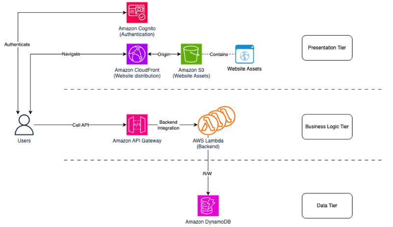

# Three-Tier Architecture on AWS

This repository contains code for a three-tier web application deployed on AWS. The architecture consists of:

1. **Presentation Tier**: Static website hosted on S3, distributed via CloudFront with Cognito authentication
2. **Business Logic Tier**: API Gateway and Lambda functions for business logic
3. **Data Tier**: DynamoDB for data storage

## Architecture Diagram



## Components Overview

- **Amazon Cognito**: Handles user authentication
- **Amazon CloudFront**: Distributes website content globally
- **Amazon S3**: Hosts static website assets
- **Amazon API Gateway**: Manages API requests
- **AWS Lambda**: Processes business logic
- **Amazon DynamoDB**: Stores application data

## Setup Instructions

### Prerequisites
- AWS Account
- AWS CLI installed and configured
- Node.js and npm
- Git

### Step 1: Set Up the Data Tier (DynamoDB)

1. Create a DynamoDB table:
   ```bash
   aws dynamodb create-table \
     --table-name UserData \
     --attribute-definitions AttributeName=userId,AttributeType=S \
     --key-schema AttributeName=userId,KeyType=HASH \
     --billing-mode PAY_PER_REQUEST
   ```

2. Add sample data to the table:
   ```bash
   aws dynamodb put-item \
     --table-name UserData \
     --item '{"userId": {"S": "1"}, "name": {"S": "John Doe"}, "email": {"S": "john@example.com"}}'
   ```

### Step 2: Set Up the Business Logic Tier (Lambda & API Gateway)

1. Create an IAM role for Lambda to access DynamoDB:
   ```bash
   aws iam create-role \
     --role-name LambdaDynamoDBRole \
     --assume-role-policy-document '{"Version":"2012-10-17","Statement":[{"Effect":"Allow","Principal":{"Service":"lambda.amazonaws.com"},"Action":"sts:AssumeRole"}]}'
   
   aws iam attach-role-policy \
     --role-name LambdaDynamoDBRole \
     --policy-arn arn:aws:iam::aws:policy/AmazonDynamoDBReadOnlyAccess
   
   aws iam attach-role-policy \
     --role-name LambdaDynamoDBRole \
     --policy-arn arn:aws:iam::aws:policy/service-role/AWSLambdaBasicExecutionRole
   ```

2. Create a Lambda function (using the Lambda.mjs file from this repo):
   ```bash
   # Create a deployment package
   zip function.zip Lambda.mjs
   
   # Create the Lambda function
   aws lambda create-function \
     --function-name UserDataFunction \
     --runtime nodejs18.x \
     --handler Lambda.handler \
     --role arn:aws:iam::<YOUR_ACCOUNT_ID>:role/LambdaDynamoDBRole \
     --zip-file fileb://function.zip
   ```

3. Create an API Gateway:
   ```bash
   # Create REST API
   aws apigateway create-rest-api \
     --name UserDataAPI

   # Get the API ID
   API_ID=$(aws apigateway get-rest-apis --query "items[?name=='UserDataAPI'].id" --output text)
   
   # Get the root resource ID
   ROOT_ID=$(aws apigateway get-resources --rest-api-id $API_ID --query "items[?path=='/'].id" --output text)
   
   # Create a resource
   aws apigateway create-resource \
     --rest-api-id $API_ID \
     --parent-id $ROOT_ID \
     --path-part "users"
   
   # Get the new resource ID
   RESOURCE_ID=$(aws apigateway get-resources --rest-api-id $API_ID --query "items[?path=='/users'].id" --output text)
   
   # Create GET method
   aws apigateway put-method \
     --rest-api-id $API_ID \
     --resource-id $RESOURCE_ID \
     --http-method GET \
     --authorization-type NONE
   
   # Create integration with Lambda
   aws apigateway put-integration \
     --rest-api-id $API_ID \
     --resource-id $RESOURCE_ID \
     --http-method GET \
     --type AWS_PROXY \
     --integration-http-method POST \
     --uri arn:aws:apigateway:<REGION>:lambda:path/2015-03-31/functions/arn:aws:lambda:<REGION>:<ACCOUNT_ID>:function:UserDataFunction/invocations
   
   # Deploy the API
   aws apigateway create-deployment \
     --rest-api-id $API_ID \
     --stage-name prod
   ```

### Step 3: Set Up the Presentation Tier (S3 & CloudFront)

1. Create an S3 bucket for website hosting:
   ```bash
   aws s3 mb s3://<YOUR_BUCKET_NAME>
   
   # Configure for website hosting
   aws s3 website s3://<YOUR_BUCKET_NAME> --index-document index.html
   
   # Set bucket policy for public read access
   aws s3api put-bucket-policy \
     --bucket <YOUR_BUCKET_NAME> \
     --policy '{
       "Version": "2012-10-17",
       "Statement": [
         {
           "Effect": "Allow",
           "Principal": "*",
           "Action": "s3:GetObject",
           "Resource": "arn:aws:s3:::<YOUR_BUCKET_NAME>/*"
         }
       ]
     }'
   ```

2. Upload the website files:
   ```bash
   aws s3 cp index.html s3://<YOUR_BUCKET_NAME>/
   aws s3 cp script.js s3://<YOUR_BUCKET_NAME>/
   aws s3 cp style.css s3://<YOUR_BUCKET_NAME>/
   ```

3. Create a CloudFront distribution:
   ```bash
   aws cloudfront create-distribution \
     --origin-domain-name <YOUR_BUCKET_NAME>.s3.amazonaws.com \
     --default-root-object index.html
   ```

### Step 4: Set Up Amazon Cognito (Optional for Authentication)

1. Create a Cognito User Pool:
   ```bash
   aws cognito-idp create-user-pool \
     --pool-name MyUserPool \
     --policies '{"PasswordPolicy":{"MinimumLength":8,"RequireUppercase":true,"RequireLowercase":true,"RequireNumbers":true,"RequireSymbols":false}}' \
     --auto-verified-attributes email
   
   # Get the User Pool ID
   USER_POOL_ID=$(aws cognito-idp list-user-pools --max-results 10 --query "UserPools[?Name=='MyUserPool'].Id" --output text)
   
   # Create a User Pool Client
   aws cognito-idp create-user-pool-client \
     --user-pool-id $USER_POOL_ID \
     --client-name MyUserPoolClient \
     --no-generate-secret
   ```

## Testing the Application

1. Access your CloudFront URL in a browser
2. Enter a valid user ID in the input field
3. The application will fetch and display the user data from DynamoDB through the API Gateway and Lambda function

## Customization

- Update the API endpoint in `script.js` with your own API Gateway URL
- Modify the Lambda function to add more features or change the data processing logic
- Customize the UI by editing the HTML and CSS files

## Security Considerations

- Use environment variables for sensitive information in Lambda functions
- Configure appropriate CORS settings on your API Gateway
- Set up proper IAM roles with least privilege principle
- Consider enabling AWS WAF for CloudFront

## Cleanup

To avoid incurring charges, delete the resources when no longer needed:

```bash
# Delete CloudFront distribution
aws cloudfront delete-distribution --id <DISTRIBUTION_ID>

# Delete S3 bucket
aws s3 rm s3://<YOUR_BUCKET_NAME> --recursive
aws s3 rb s3://<YOUR_BUCKET_NAME>

# Delete API Gateway
aws apigateway delete-rest-api --rest-api-id <API_ID>

# Delete Lambda function
aws lambda delete-function --function-name UserDataFunction

# Delete IAM role
aws iam detach-role-policy --role-name LambdaDynamoDBRole --policy-arn arn:aws:iam::aws:policy/AmazonDynamoDBReadOnlyAccess
aws iam detach-role-policy --role-name LambdaDynamoDBRole --policy-arn arn:aws:iam::aws:policy/service-role/AWSLambdaBasicExecutionRole
aws iam delete-role --role-name LambdaDynamoDBRole

# Delete DynamoDB table
aws dynamodb delete-table --table-name UserData

# Delete Cognito User Pool
aws cognito-idp delete-user-pool --user-pool-id <USER_POOL_ID>
``` 